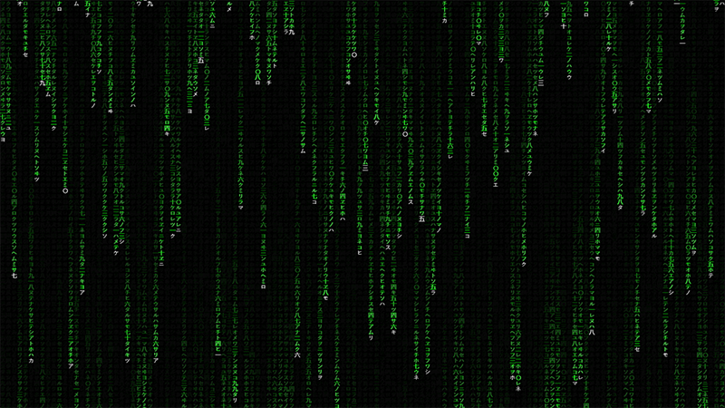

# matrix
The Matrix Code Effect

This little project should maybe be in my canvas repository,
but I wanted to highlight it now that the movie this effect 
is inspired by is trending again.

Nothing new, since it is a visual effect that I have already 
seen implemented in the old screensavers for Windows with 
different success. But this time I decided to implement it 
in JavaScript using the HTML5 canvas element and a little 
trick to generate a trail from white to green.

I hope you find it interesting and entertaining as it was for me!

Screenshot #1:

